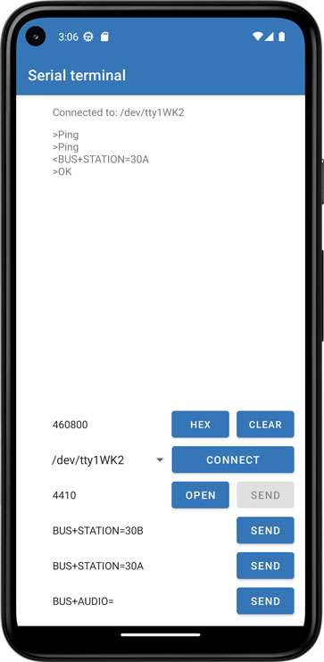

# Android Serial Terminal

**[🇷🇺 Русская версия](#-русская-версия)**



---
**Android Serial Terminal** is a universal communication terminal for working with **UART / RS232 / RS485** interfaces on Android devices.  
Unlike typical USB-only serial apps, this project supports a wide range of hardware-level serial interfaces.

### 🔧 Features

- Supports **hardware UART ports** (`/dev/ttyS*`, `/dev/ttyUSB*`, `/dev/ttyACM*`, etc.)
- High performance through **JNI + C++** implementation
- Fully configurable:
  - **Baud rate**
  - **Data bits**, **stop bits**, and **parity**
- Binary **read/write** operations
- Easy integration into Android apps (Java / Kotlin API)

### 🧩 Project Structure

```
├── CMakeLists.txt         # CMake build configuration
├── uart-lib.cpp           # JNI bridge between Java and C++
├── DevUart.cpp / .h       # UART communication logic
└── app/                   # Android app source
```

### ⚙️ Build Instructions

1. Open in **Android Studio**
2. Make sure you have:
   - **NDK**
   - **CMake 3.22.1+**
   - **Android SDK 24+**
3. Build:
   ```bash
   ./gradlew assembleDebug
   ```
4. The native library `libserial_terminal.so` will be automatically packaged into your APK.

### 🧠 JNI Interface

```cpp
jint     openPort(String path, int baudrate, int databits, int stopbits, char parity)
jbyte[]  readPort(int max_size, int timeout)
void     writePort(byte[] data, int length)
void     closePort()
```

Example in Kotlin:
```kotlin
val uart = UARTPort()
if (uart.openPort("/dev/ttyS4", 115200, 8, 1, 'N')) {
    uart.writePort("Hello".toByteArray())
    val response = uart.readPort(256, 100)
    uart.closePort()
}
```

### 🖥️ Supported Devices

- Android phones/tablets with **USB OTG**
- Embedded Android boards (**Rockchip**, **Allwinner**, **Amlogic**, **Qualcomm**)
- POS terminals and SBCs with native UART ports

### ⚠️ Permissions

```xml
<uses-permission android:name="android.permission.READ_EXTERNAL_STORAGE" />
<uses-permission android:name="android.permission.WRITE_EXTERNAL_STORAGE" />
<uses-permission android:name="android.permission.MANAGE_EXTERNAL_STORAGE" />
```

Some devices require root access or proper permissions:
```bash
chmod 666 /dev/ttyS*
```

### 🧾 Credits

Based on original work by **BevisWang (CSDN, 2018)**  
[https://blog.csdn.net/PD_Wang/article/details/81449768](https://blog.csdn.net/PD_Wang/article/details/81449768)

### 📄 License

**MIT License** — free to use, modify, and distribute.


---
## 🇷🇺 Русская версия

**Android Serial Terminal** — это универсальный терминал для работы с последовательными портами (**UART**) на Android-устройствах.  
В отличие от стандартных решений, ограниченных USB Serial, проект поддерживает широкий спектр аппаратных интерфейсов: встроенные UART, RS232, RS485 и другие.

### 🔧 Возможности

- Поддержка **аппаратных UART-портов** (`/dev/ttyS*`, `/dev/ttyUSB*`, `/dev/ttyACM*` и др.)
- Высокая производительность за счёт **JNI / C++**-реализации
- Настраиваемые параметры:
  - **Скорость передачи** (baudrate)
  - **Биты данных**, **стоп-биты**, **чётность**
- **Чтение и запись** в бинарном режиме
- Полная интеграция с Android-приложением (через Java / Kotlin API)

### 🧩 Структура проекта

```
├── CMakeLists.txt         # Конфигурация сборки native-библиотеки
├── uart-lib.cpp           # JNI-интерфейс между Java и C++
├── DevUart.cpp / .h       # Логика работы с UART-устройствами
└── app/                   # Android Studio проект (Java/Kotlin часть)
```

### ⚙️ Сборка и установка

1. Открой проект в **Android Studio**  
2. Убедись, что установлены:
   - **NDK**
   - **CMake (3.22.1 или выше)**
   - **Android SDK 24+**
3. Собери проект:
   ```bash
   ./gradlew assembleDebug
   ```
4. В APK будет встроена библиотека `libserial_terminal.so`

### 🧠 JNI интерфейс

Нативная библиотека экспортирует методы:

```cpp
jint     openPort(String path, int baudrate, int databits, int stopbits, char parity)
jbyte[]  readPort(int max_size, int timeout)
void     writePort(byte[] data, int length)
void     closePort()
```

Пример вызова из Kotlin:

```kotlin
val uart = UARTPort()
if (uart.openPort("/dev/ttyS4", 115200, 8, 1, 'N')) {
    uart.writePort("Hello".toByteArray())
    val response = uart.readPort(256, 100)
    uart.closePort()
}
```

### 🖥️ Поддерживаемые устройства

- Смартфоны / планшеты с **USB OTG**
- Промышленные Android-платы (**Rockchip**, **Allwinner**, **Amlogic**, **Qualcomm**)
- POS-терминалы и SBC с встроенными UART портами

### ⚠️ Разрешения и доступ

```xml
<uses-permission android:name="android.permission.READ_EXTERNAL_STORAGE" />
<uses-permission android:name="android.permission.WRITE_EXTERNAL_STORAGE" />
<uses-permission android:name="android.permission.MANAGE_EXTERNAL_STORAGE" />
```

Некоторым устройствам требуется root-доступ или настройка прав:
```bash
chmod 666 /dev/ttyS*
```

### 🧾 Основано на

Часть кода заимствована из примера **BevisWang (CSDN, 2018)**  
[https://blog.csdn.net/PD_Wang/article/details/81449768](https://blog.csdn.net/PD_Wang/article/details/81449768)

### 📄 Лицензия

Лицензия: **MIT** — свободно используйте и модифицируйте.


---
💡 **Author:** [Danil Murashkin](https://github.com/danil-murashkin)  
📅 Version: 1.0  
📍 Android 7.0+ compatible
